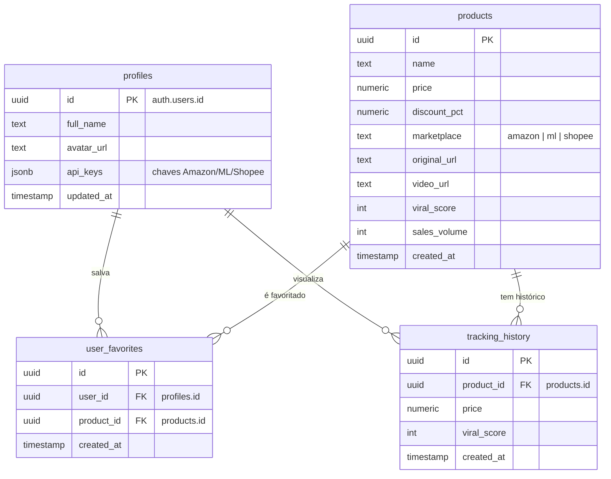

# 🗄️ MODELO DE DADOS - BATEU COMPROU V2 (SUPABASE)

Modelagem relacional para PostgreSQL focada em performance e escalabilidade do ecossistema de afiliados.

## 📊 ENTIDADES E RELAÇÕES (ER)



## 🛠️ SQL DDL (SUPABASE/POSTGRES)

### 1. Extensões e Tipos
```sql
-- Habilitar UUID-OSSP
create extension if not exists "uuid-ossp";

-- Tipo enumerado para Marketplace
create type marketplace_type as enum ('amazon', 'ml', 'shopee');
```

### 2. Tabela de Perfis (Profiles)
```sql
create table public.profiles (
  id uuid references auth.users on delete cascade not null primary key,
  full_name text,
  avatar_url text,
  api_keys jsonb default '{}'::jsonb,
  updated_at timestamp with time zone default timezone('utc'::text, now()) not null
);
```

### 3. Tabela de Produtos (Products)
```sql
create table public.products (
  id uuid default uuid_generate_v4() primary key,
  name text not null,
  price numeric(12,2) not null,
  discount_pct numeric(5,2),
  marketplace marketplace_type not null,
  original_url text unique not null,
  video_url text,
  thumbnail_url text,
  viral_score int default 0,
  sales_volume int default 0,
  created_at timestamp with time zone default timezone('utc'::text, now()) not null
);
```

### 4. Favoritos do Usuário (User Favorites)
```sql
create table public.user_favorites (
  id uuid default uuid_generate_v4() primary key,
  user_id uuid references public.profiles(id) on delete cascade not null,
  product_id uuid references public.products(id) on delete cascade not null,
  created_at timestamp with time zone default timezone('utc'::text, now()) not null,
  unique(user_id, product_id)
);
```

### 5. Histórico de Preços (Tracking History)
```sql
create table public.tracking_history (
  id uuid default uuid_generate_v4() primary key,
  product_id uuid references public.products(id) on delete cascade not null,
  price numeric(12,2) not null,
  viral_score int,
  created_at timestamp with time zone default timezone('utc'::text, now()) not null
);
```

## 🛡️ SEGURANÇA (RLS)
- **Profiles**: Apenas o próprio usuário pode ler e editar seu perfil.
- **Products**: Todos os usuários autenticados podem visualizar.
- **User Favorites**: Apenas o proprietário pode visualizar e gerenciar seus favoritos.
